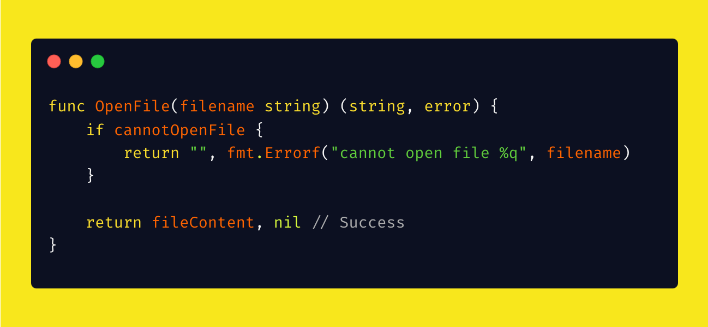
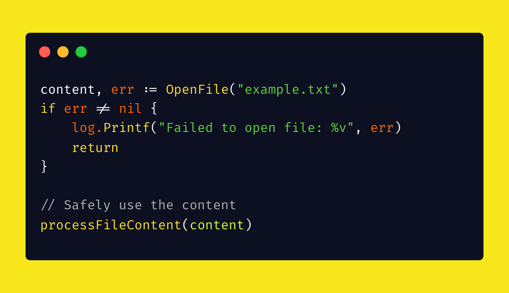

# Tip #Don't Return -1 or nil to Indicate Error.

> 原始链接：[Golang Tip #16: Don't Return -1 or nil to Indicate Error.](https://twitter.com/func25/status/1755903433671106993)

In other languages, it's common practice for functions to indicate errors or missing results by returning special values like -1, null, "",...

This is called "In-band errors".

The main issue with in-band error signaling is, it requires the caller to remember to check for these special values every time.

This is... error-prone.

Also, this approach is not the best (or even good) in Go since it supports multiple return values.

Go's solution: Multiple return values

A function can return its usual result along with an additional value (error or bool) that explicitly signals whether the operation was successful.

This makes the code clearer.

Using the result without checking the success indicator (ok bool) results in a compile-time error.

And this forces us to handle the possibility of failure explicitly:

So now, your code has 3 things (you don't even need to care):

Clear separation of concerns
Which part of the return value is the actual result and which part indicates the success or failure of the operation.

Forced error handling
The Go compiler requires developers to address the possibility of an error, reducing the risk of overlooking it (so, don't ignore errors with \_).

Improved readability and maintainability
The code explicitly documents itself.
