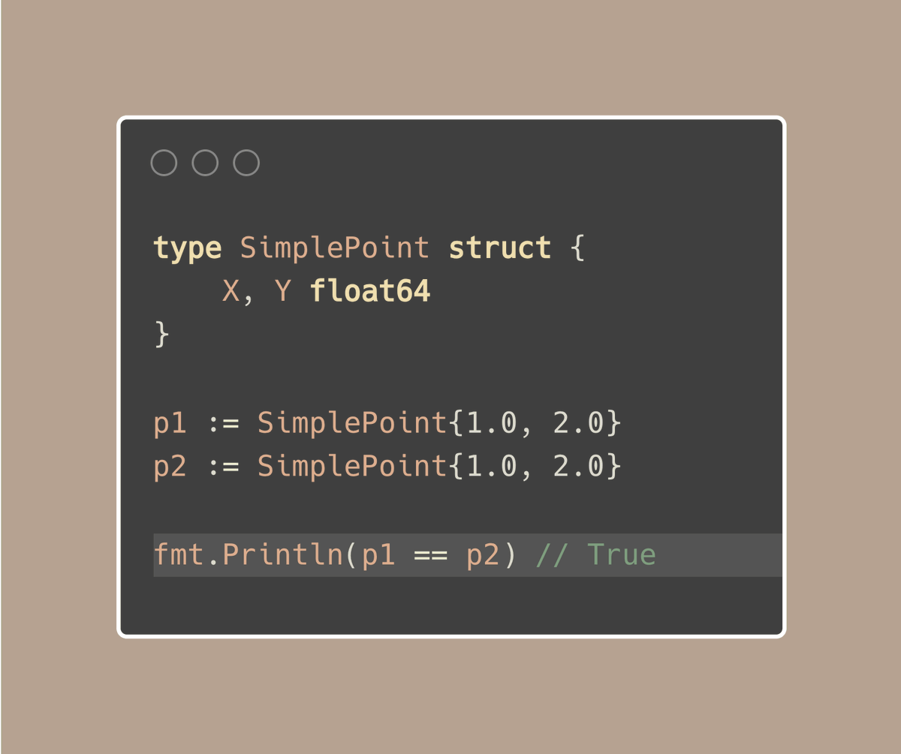
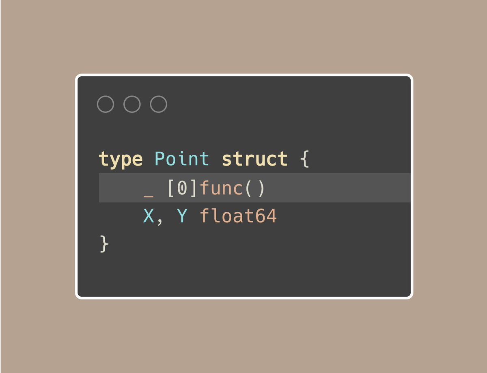
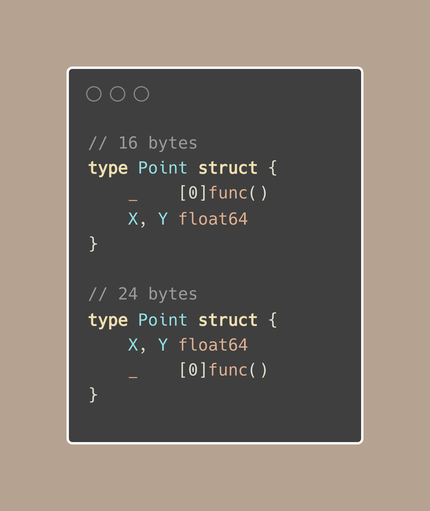

# Tip #Make Structs Non-comparable

> 原始链接：[Golang Tip #50: Make Structs Non-comparable](https://twitter.com/func25/status/1768621711929311620)

In Go, if every field within a struct is comparable, then the struct itself is comparable.

This means you can use == and != operators to compare two structs directly:

However, directly comparing structs that contain floats can be problematic.

Floating-point values should ideally be compared with an approximation.

We might prefer our teammate to use a custom .Equals method for comparison:

But let's face it, using p1 == p2 is straightforward, fast, and tempting for anyone not aware of the nuances.

To ensure that every dev uses your comparison methods, here's a zero-cost strategy:

The [0] func() has 3 properties:

- Unexported: Keeping it hidden from users of your struct.
- Zero-width (or no-cost): This array takes up no space in memory because its length is zero.
- Non-comparable: func() is a function type, and functions are non-comparable in Go.

Trying to compare 2 instances of such a struct directly with == or != will trigger a compile-time error: "invalid operation: a == b (struct containing [0]func() cannot be compared)"

But, remember not to place the \_ [0]func() at last.

Although it doesn't occupy space, its placement can still influence the size of our struct:

For further understanding of the alignment (and padding), consider these 2 resources:

- Tip #41: Sort your fields in your struct from largest to smallest. (https://twitter.com/func25/status/1765371933053612110).
- Issue #9401 on the Go repository: https://github.com/golang/go/issues/9401
