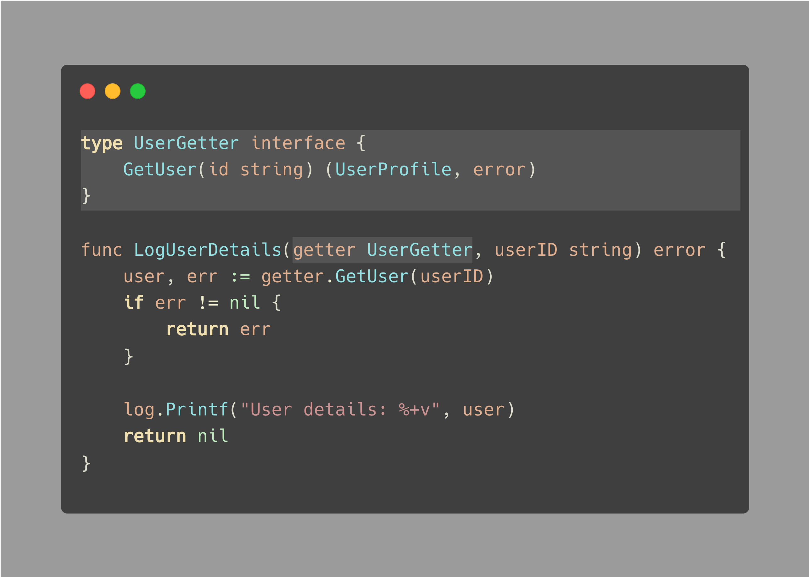

# Tip #56 简化接口并只要求你真正需要的东西

> 原始链接：[Golang Tip #56: Simplify interfaces and only ask for what you really need](https://twitter.com/func25/status/1771187871032176691)
> When making interfaces in Go, follow these tips:

1. Never define an interface until there's an actual need for it.
2. Accept interfaces and return concrete types.
3. Put interfaces where they're used (consumer), not where they're made (provider). (https://twitter.com/func25/status/1756629777107292231)

The #3 tip actually builds on the #1.

But there is one more tip, let's say we're following "#2. Accept interfaces and return concrete types".

Can you spot an issue in the below example?

(The example above demonstrates the purpose of the tip, it may not follow the best practice, good naming, etc.)

The problem is, LogUserDetails(..) only needs the GetUser method, not the CreateUser or UpdateUser methods.

This setup isn't great because it ties the function to a broad interface, which makes testing harder, reduces flexibility, and makes it less readable.

Now, interfaces facilitate abstraction, but the larger the interface, the less abstract it becomes.

> "Why is this bad for testing?"

When we test, we shouldn't have to figure out which methods of the input interface are used, right?

And it's also a little hassle to set up a big mock that we don't need.

So, what's better?

You've probably guessed it, our function should ask for an interface that has just what it needs:

And any concrete type that fits the UserManager should also fit the UserGetter as well.

A simple change makes the code more testable and clearer.
