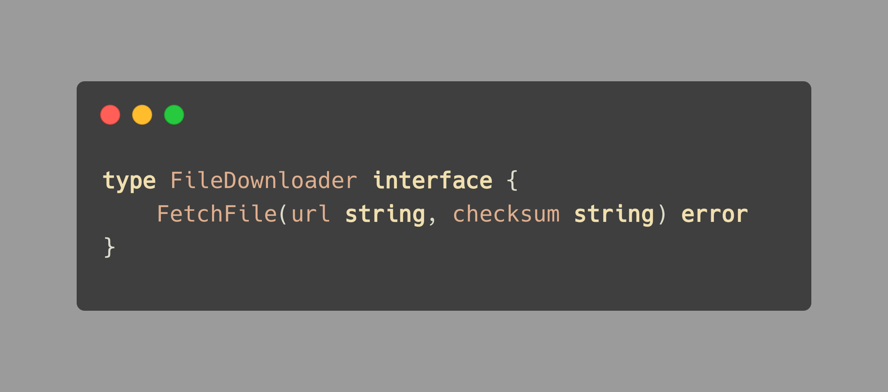

# Tip #If a parameter isn't needed, either drop it or ignore it on purpose.

> 原始链接：[Golang Tip #59: If a parameter isn't needed, either drop it or ignore it on purpose](https://twitter.com/func25/status/1772225989143417031?t=nJCezW_QhRtqsWzSzHOMJw)

Before we dive into the tip, let's look at a problem in the following example:

In this case, the FetchFile function is given a URL and a checksum for a file. But, we only use the URL to get the file and leave the checksum out of it.

The thing is, the compiler won't tell you if you forgot to use an argument in a function, unlike with local variables.

Because of this, it's not clear if the checksum, which should be there for checking the file's okay, was missed by accident or left out on purpose.

The solution

We've got two ways to handle this:

- Do it on purpose and use an underscore \_ to ignore it.
- Remove the unused parameter completely.

Let's use the tip to make the function better:

By switching the checksum argument for an _, we're clearly saying we're skipping it on purpose. And we can use as many _ as we need.

> "Why not just take it out?"

Taking it out is one way to fix it.

But sometimes we need to stick to a certain pattern, like when we're following an interface or a specific way a function is supposed to be:

However, if we're using a lot of \_, it could be a sign that something's not quite right with the way we've designed things.
