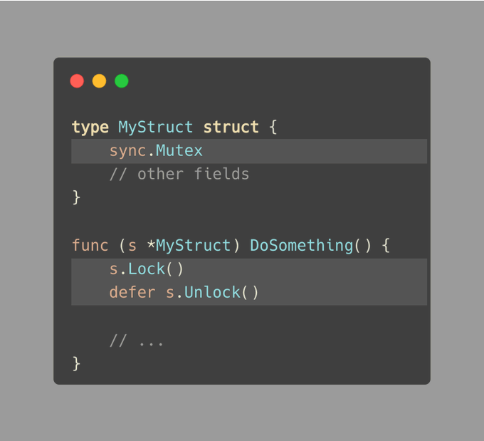
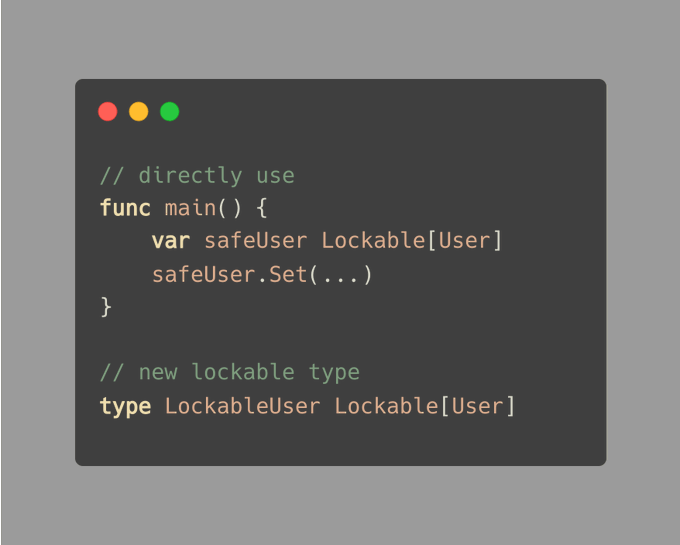

# Tip #61 使用内置锁的类型（sync.Mutex嵌入）

>  原始链接：[ Golang Tip #61: Making a Type with Built-In Locking (sync.Mutex embedding)](https://twitter.com/func25/status/1772934326189240607)
>

写代码时，我们经常需要让程序的多个部分同时被访问，为此我们通常使用 `sync.Mutex` 来确保安全性。

下面是一种常见的做法：

但这种解决方案会使我们的代码中充斥着 `.mu.Lock()` 和 `.mu.Unlock()` 的调用。

为了简化代码，我们可以将 `sync.Mutex` 直接嵌入到结构体中。现在我们只需在结构体本身上调用 `Lock` 和 `Unlock`：

但请注意：如果 `MyStruct` 是公共的（以大写字母开头），直接添加 `sync.Mutex` 会使其 `Lock` 和 `Unlock` 方法也变为公共方法。

因此，对于不打算在包外共享的类型，这可能是一个更好的选择。

**通用技巧**

在查看一些想法和在线资源时，我发现了这个巧妙的方法。

要创建一个已准备好进行锁定的类型，您可以使用通用类型：

（事实证明，我们无法将 `T` 嵌入到 `Lockable` 中。）

通过这种方式，我们可以保护任何类型不被同时用于太多地方。您可以直接使用它，或者创建一个新类型：

