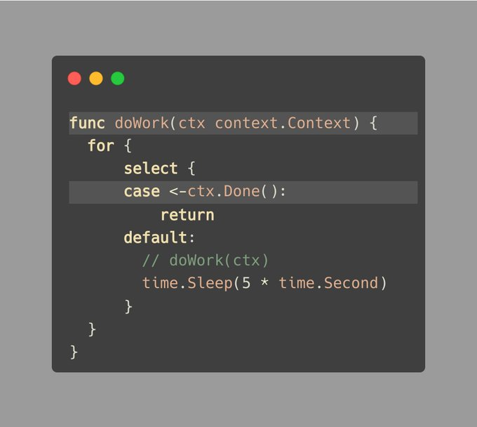
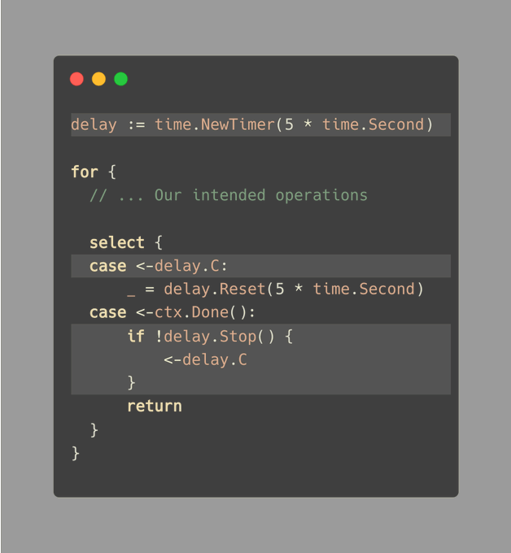

# Tip #63 避免使用 time.Sleep()，它不能被 context 感知且无法被中断

> 原始链接：[ Golang Tip Tip #63: Avoid time.Sleep(), it's not context-aware and can't be interrupted.](https://twitter.com/func25/status/1773701845267153348)

Using time.Sleep might seem useful and handy, but time.Sleep isn't aware of context and can't be interrupted.

For instance, if our application is shutting down, we can't signal a sleeping function. Once it wakes up, it starts some logic, only to be interrupted while working.

I've made this mistake myself and used it as a learning point for these tips:

These loops do some work, then pause for 5 seconds with time.Sleep, and continue.

But, the loops can't be stopped by a context cancellation, which is a problem if we need to stop everything quickly.

Let's pass context to make our work respect it:

This is better; it's a little verbose but our job respects the context now, for example:

1. -> doWork -> sleep -> shutdown -> ctx.Done() -> out.
2. -> doWork -> shutdown -> sleep -> ctx.Done() -> out

(We could bring the doWork(ctx) right below the for loop to reduce nested.)

But still, we have to wait 5 seconds or maybe longer, depending on the job delay.

Using the time package as a signal

Now, the solution we are discussing uses the time package, but with a couple of nuances.

The first fix involves time.After, shown here in a loop:

This approach is easy and to-the-point, but it's not perfect.

- We're allocating a new channel each time.
- The Go community points out that time.After can cause short-term memory leaks.

If our function ended because ctx.Done(), before the countdown, then 'time.After' will still be there until the time expires.

The second fix may be more verbose but aims to solve this:

We set a timer, and when it runs out, we start it up again.

When the context is done, it's important that we stop the timer to avoid leaking, using the same solution above, or 'defer delay.Stop()'.

The last solution is not perfect.

Putting our work directly under the for loop can make the code less nested. But it doesn't ensure the timer is correct the first time.

You may want to put our intended logic below 'case <- delay.C'.
