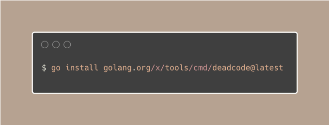
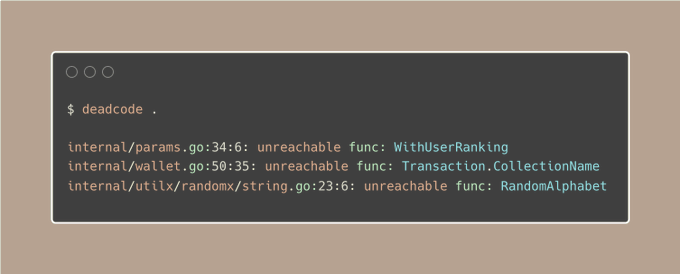

# Tip #Use the deadcode tool to find and remove unused functions

> 原始链接：[ Golang Tip #68: Use the deadcode tool to find and remove unused functions](https://twitter.com/func25/status/1776223724913725925)
>
> We sometimes have code that isn't used, which we call "dead code".

It can make it harder for you to work on your code because we're not sure if you can remove it or change it.

Luckily, there's a tool called deadcode that can help we find this unused functions. We can install with this command:

I put it here so you can copy: go install http://golang.org/x/tools/cmd/deadcode@latest

And run it using this short command:

When we run it, it will show us the functions that aren't being used, with their location in your code.

If you want to know why a function is being used, we can use the -whylive flag, and the tool will tell us how the function is connected to the rest of our code.

From my experience, there may be a few times when the tool isn't right. So, use this tool to help you decide what code you can remove.

How it works (simplified)

1. The tool starts by reading all the code, checks the types.

2. It identifies the main() and any init() as the starting points.

3. From these starting points, deadcode looks at what functions are called directly. It makes a list of these functions because they are being used.

4. It then checks for functions that are called indirectly, through interfaces.

5. The tool keeps track of any types that are converted into interfaces because the methods of these types may be called indirectly.

6. Any function that isn't on this list after the tool has finished its analysis is considered "dead." This means the function isn't connected to the main path of running code.

---

You can read more about finding and removing dead code here: https://go.dev/blog/deadcode
