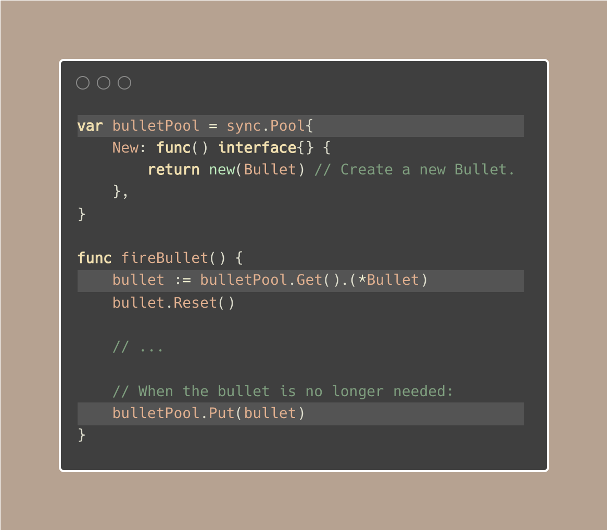
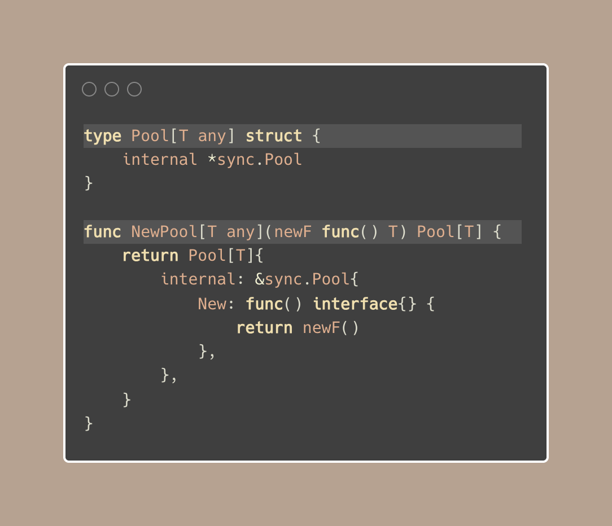
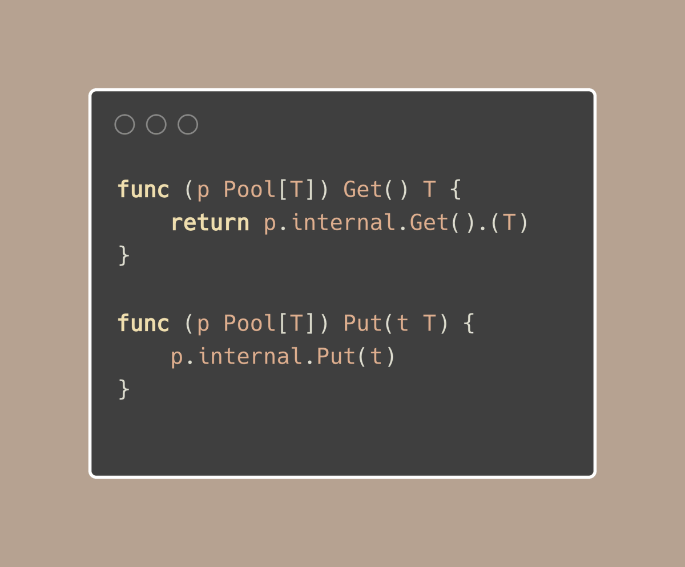

# Golang Tip #reuse object using sync.Pool, make it typed-safe with generics.

## 什么是 sync.Pool?

> 原文链接：[Golang Tip #71: sync.Pool, make it typed-safe with generics.](https://twitter.com/func25/status/1777309778852859954)

What is sync.Pool?

Before going to the typed-safe pool, for those who aren't familiar with sync.Pool, it's a Go standard library feature used to reuse objects.

This can reduce the number of memory allocations, which is beneficial for performance.

Imagine a gun that fires hundreds of bullets per second, it would be wasteful to allocate a new bullet in memory for each shot.

Instead, you could have a pool of ~100 bullets and reuse them from that pool:

But, remember these points about it:

- sync.Pool doesn't have a fixed size, so we can add and retrieve items without a limit.
- After we put an object back in the pool, forget about it, it might get removed or collected.
- Objects may have states and we should clear or reset the state before putting or after retrieve from pool.

Typed-safe Pool

Now let's talk about making sync.Pool type-safe.

We have seen sync.Pool uses the empty interface (interface{}) for storing and retrieving items. In a type-safe version, we wrap this process:

Just like that, we create a pool tied to a specific type T, but it still uses interface{} under the hood.

The solution comes from how we handle getting and putting data in a type-safe manner:

Post
See new posts
Conversation
Phuong Le
@func25
💡 Golang Tip #71: sync.Pool, make it typed-safe with generics.

What is sync.Pool?

Before going to the typed-safe pool, for those who aren't familiar with sync.Pool, it's a Go standard library feature used to reuse objects.

This can reduce the number of memory allocations, which is beneficial for performance.

Imagine a gun that fires hundreds of bullets per second, it would be wasteful to allocate a new bullet in memory for each shot.

Instead, you could have a pool of ~100 bullets and reuse them from that pool:

But, remember these points about it:

- sync.Pool doesn't have a fixed size, so we can add and retrieve items without a limit.
- After we put an object back in the pool, forget about it, it might get removed or collected.
- Objects may have states and we should clear or reset the state before putting or after retrieve from pool.

Typed-safe Pool

Now let's talk about making sync.Pool type-safe.

We have seen sync.Pool uses the empty interface (interface{}) for storing and retrieving items. In a type-safe version, we wrap this process:

Just like that, we create a pool tied to a specific type T, but it still uses interface{} under the hood.

The solution comes from how we handle getting and putting data in a type-safe manner:

We take data from the pool as usual, but we convert the interface to type T without checking for errors.

> "Why don't we check for errors in conversion?"

The generic layer already ensures the type for us, so we don't need to worry about the conversion failing.

The sync.Pool will only ever contain instances of type T, so the assertion p.internal.Get().(T) will not panic under normal situations.

https://go.dev/play/p/N3suxuK-yCp
