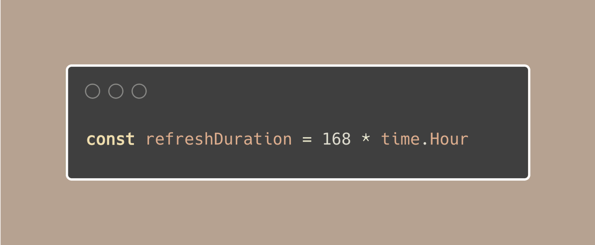
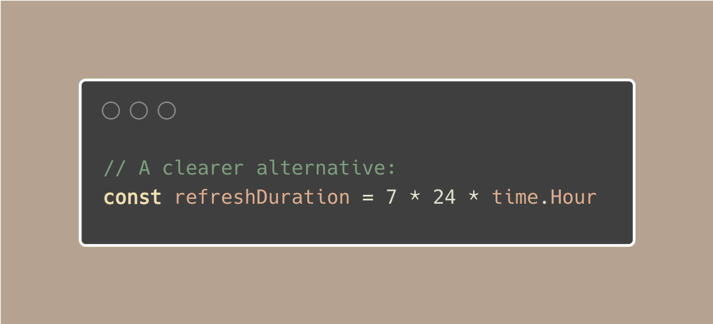

# Tip #Make time.Duration clear and easy to understand

> 原始链接：[ Golang Tip #74: Make time.Duration clear and easy to understand](https://twitter.com/func25/status/1778408767300002050)

When you're coding with time intervals, you'll be using the time.Duration type a lot.

A common issue that can make things confusing is when you use seconds:

In Go, it's usually NOT the usual way to do it, but if we need to use seconds for any reason, we can use an untyped constant:

These constants are flexible because they don't stick to one type, they adapt to whatever type they're used with.

Here's an example that's correct but could be clearer:

Seeing 168 \* time.Hour might not immediately tell us that it's 1 week.

To make it super clear what we mean, we could set it up like this:

Now, when someone reads our code, they can see right away that refreshDuration is 1 week, without having to think about how many hours that is.

Keep your code clear and easy to read, it helps everyone out.
