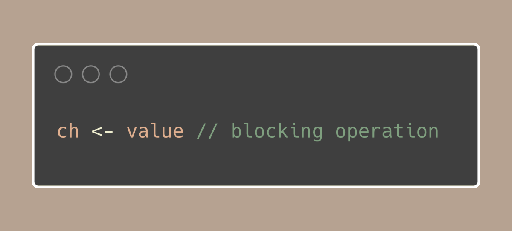
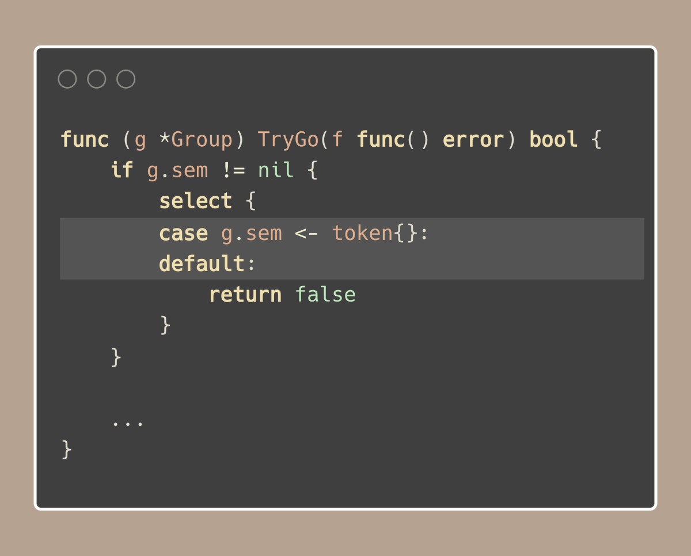

# Tip #Non-blocking channel send trick

> 原始链接：https://twitter.com/func25/status/1780207297991782834

When we send a value to a channel, we typically wait for the receiver to be ready to take the value:

But there are times when we don't want to wait.

For example, if you've followed the previous tip on using semaphore, we could have a TryAcquire() bool function that returns immediately if all tokens are already taken.

If you missed the last tip - Tip #77: Buffered channels as semaphores to limit goroutine execution (https://twitter.com/func25/status/1779871103344873757)

Looking at the errgroup as an example, behind the scene, it uses a simple semaphore mechanism internally to manage the number of goroutines.

Now, if the semaphore is full, we want it to immediately return false if it can't start, much like mutex.TryLock().

Let’s see how errgroup handles this:

Focus on the select{} statement inside the if condition.

Usually, the select{} is used to wait for values from multiple channel operations, but it's used in a unique way here:

- case g.sem <- token{}: This line attempts to send a token to the semaphore channel g.sem. If there's space (meaning it's not at its limit), the token is sent successfully, and this part of the code executes.

- default: This case is chosen if the g.sem channel is full.

The default case in the select statement runs right away if the other cases aren't ready to go.

In this case, it returns false to notify us that the function didn't start a new goroutine because we've reached the maximum number of active goroutines that we set earlier.
