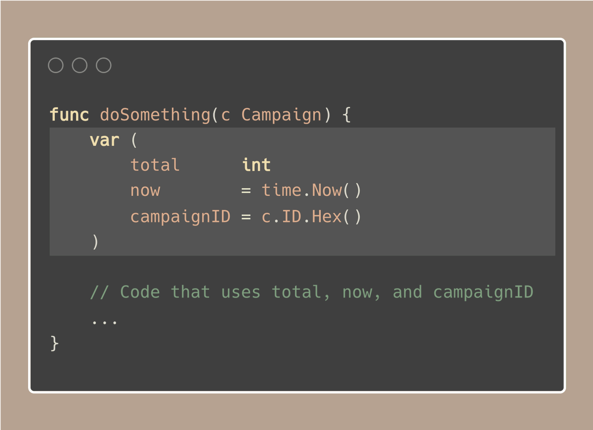

# Tip #Declare variables NEAR their usage

> 原始链接：[Golang Tip #80: Declare variables NEAR their usage](https://twitter.com/func25/status/1784941332668223956)

This is a common mistake among those who have been using Go for a little while.

People often put all the variables at the top of the function, and even worse, they use 'var':

While this might look neat or seem like a simple way to keep track of what variables are being used, it can actually make the code harder to read and maintain.

Take a variable named 'total', for instance.

If it's declared way up at the beginning, by the time you see it used in the code, you might not remember what it was for without scrolling back up.

Ideally, you want to declare variables as close as possible to where they are used:

This way, it's clear what each variable is for right when you see it, which makes reading and understanding the code a lot easier.

There might be a reason to place variables at the top occasionally, but it's not common. Also, using 'var' tends to shift the focus to the right side of the screen (nested), which isn't where our eyes naturally scroll.
