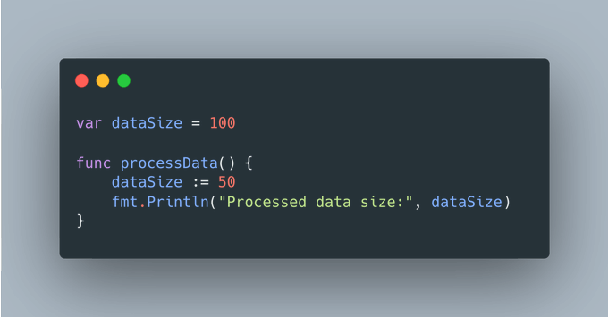
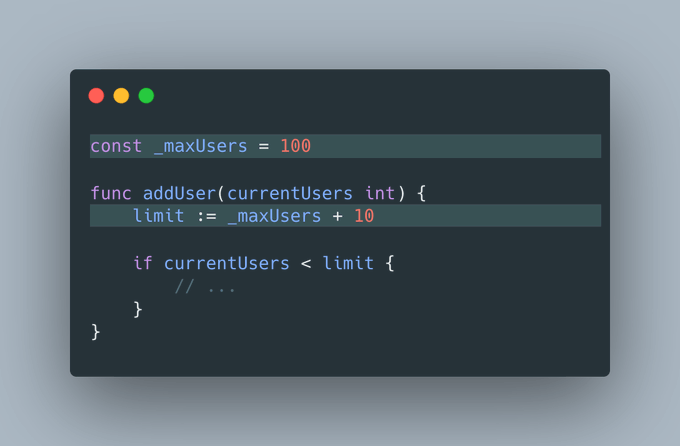

# Tip #36 以下划线（_）作为前缀，命名非导出的全局变量
> 原始链接：[Golang Tip #36: Naming Unexported Global Variables with an Underscore (_) Prefix.](https://twitter.com/func25/status/1763527891466522656)
>
（注：此命名规则在Go社区并没有被普遍认可为惯用做法，而是受到Uber编码风格指南的启发）

在Go语言中，声明在顶层的变量和常量可以在它们所属的整个包中被访问。

**常规命名方式有何不妥？**

如果没有明确的命名约定，我们很容易在更小的作用域内无意中覆盖这些包级别的变量。

设想一下，一个命名为 dataSize 的局部变量可能会覆盖同名的全局变量。

> 但如果它们的命名不同，还会有什么问题呢？”

尽管这个例子看似简单，但它却引发了一个问题：我们如何知道 maxUsers 变量的来源？

- 它是一个像 'limit' 这样的局部变量？
- 还是函数的一个参数？
- 或者是来自全局作用域？

在更复杂的场景中，我们可能不得不四处搜索或使用IDE的快捷键（如cmd + click）来查找并跳转到变量的定义。这个过程可能会分散我们的注意力并打断我们的工作流程。

**使用下划线前缀**

通过在全局变量前添加下划线 (_)，可以明确表示这些标识符是全局的：

这种明确的标识使得“_maxUsers”被一眼识别为全局变量，大大降低了我们无意中覆盖或修改它的风险。