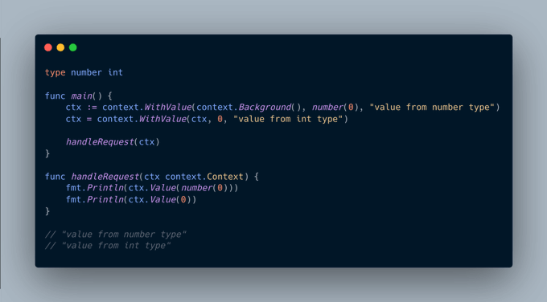

# Tip #37：使用未导出的空结构体作为上下文键
> 原始链接：[Golang Tip #37: Using Unexported Empty Struct as Context Key](https://twitter.com/func25/status/1763897057511899516)
>

context包不仅可用于传递取消信号和设置截止日期，也常用于传递请求范围的值。

我们可以在上下文中添加一个值，将其向下传递，然后再获取它：

挑战在于，我们如何确保我们的键（本例中是“data”）是唯一的？

完全有可能其他人已经使用“data”作为键，因此可能存在潜在的冲突。

这正是空结构体发挥作用的地方，每个结构体相比于其他结构体都是唯一的：

一般来说，使用未导出（私有）的空结构体，我们可以避免由其他包引起的任何潜在冲突。

> “我可以使用其他类型吗，尽管其底层类型依然是字符串或整数？”

是的，我们当然可以使用其他类型，并且应该可以避免冲突。例如，一个底层类型为int，数值为0的number和一个int(0)是不同的：

这背后的原理归结为 Go 如何比较 interface{}，只有当两个 interface{} 的类型和值都匹配时，它们才相等。

- 第一个值：{ 类型：number，值：0 }

- 第二个值：{ 类型：int，值：0 }

它们是不同类型的，因此它们不相等。

> “但为什么会选择使用一个空的struct{}呢？”

一个空结构体不会分配内存，它没有字段因而不包含数据，但它的类型仍然可以唯一地标识上下文值。

当然，我们仍然会在某些情况下使用具有底层基本类型的类型定义。

（使用上下文值是我一直避免的事情，尤其是在编写业务逻辑时。它不是编译时安全的，并且难以追踪和调试。）