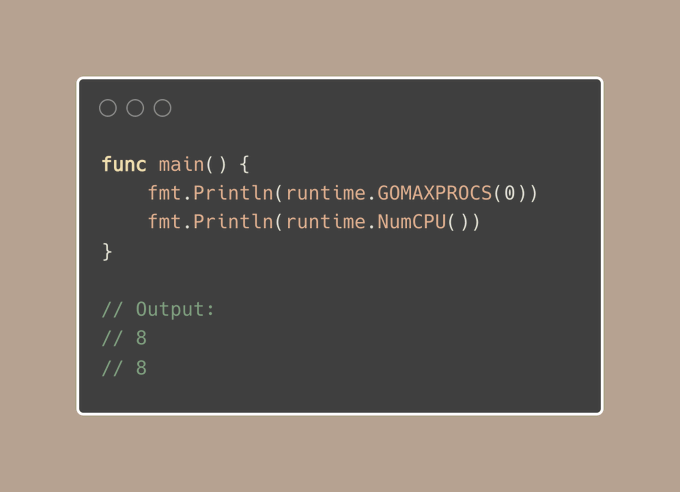
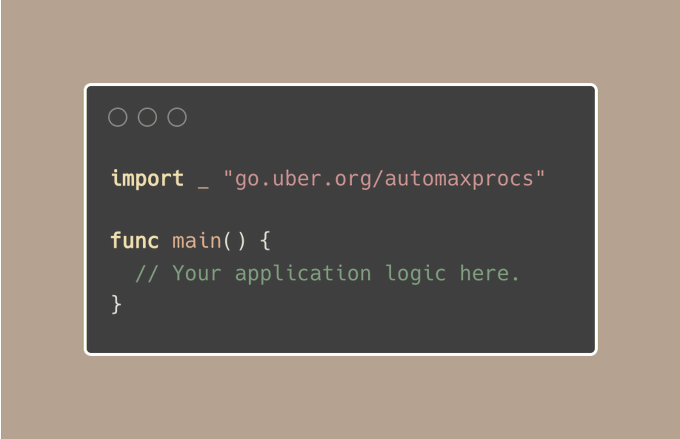

# Tip #52 针对容器化环境（Kubernetes、Docker等）调整GOMAXPROCS

>  原始链接：[ Golang Tip #52: Adjusting GOMAXPROCS for Containerized Env (Kubernetes, Docker, etc.)](https://twitter.com/func25/status/1769315593122177195)

**什么是GOMAXPROCS？**

默认情况下，Go可以并发执行高达10,000个线程，但实际上并行运行的线程数量取决于一个关键设置：GOMAXPROCS。

GOMAXPROCS决定了可以同时运行用户级Go代码的系统线程数量上限（注意是真正的并行执行，而不仅仅是并发）。

它的默认值与操作系统的逻辑CPU核数是一致的（可通过runtime.NumCPU()函数获取）：

例如在我的8核MacOS上，默认情况下Go可同时处理多达8个线程。

**容器化环境（Docker和Kubernetes）运行Go程序**

在诸如K8s这样的容器化环境下，我们可以为每个容器设置CPU限制，实际上是在告诉容器：“你最多能使用这么多CPU资源”

例如，限制参数为250m意味着可以使用1/4个CPU，而1则表示可以使用1个CPU。

然而Go默认没法自行识别容器配置的CPU资源限制。它依旧会根据宿主机上的CPU核心总数进行运算，而非容器分配到的数量。

（宿主机或节点上可以运行多个pod）

结果就是，Go程序可能会尝试使用超过其被分配份额的 CPU 。

> “难道不是使用更多 CPU 资源更佳吗？”

这背后有几个原因：

1. 上下文切换：当线程数量超过CPU核心数量时，操作系统会频繁在多个线程间切换。

2. 调度效率低：Go的调度器可能会创建出比实际CPU限制下可执行的更多的goroutine，从而导致CPU时间的争夺。

3. CPU密集型任务的使用效率欠佳：Go程序通常是CPU密集型的，这意味着当每个线程可以分配到一个独立的CPU上执行，而无需等待时，它们的表现最佳。

如果我们设置的GOMAXPROCS超过了分配给容器的CPU核心数，就会迫使Go运行时规划超过实际可用核心数的线程，导致CPU密集型任务的执行效率降低。

**解决方案是什么？**

对于那些想要“省心”的开发者，[uber-go/automaxprocs](https://github.com/uber-go/automaxprocs)可能是个不错的选择。这个库可以自动调整GOMAXPROCS以适配容器的CPU限制。

（如果你想了解uber-go/automaxprocs背后的原理，请告知我）

另外，如果你对deployment或pod规范有所了解，你可以直接在环境变量中设置GOMAXPROCS，以匹配CPU限制。

但我更倾向于从DevOps的角度讨论这个问题，建议尽量避免设置CPU限制，而应始终指定CPU请求（详情稍后说明），这一点不只是针对Go服务。

如果你的容器没有明确的CPU限制，这是一个值得深思的问题。

----
- [求你了，请停止在Kubernetes上使用CPU限制（更新版本)](https://www.reddit.com/r/kubernetes/comments/wgztqh/for_the_love_of_god_stop_using_cpu_limits_on/)
- [Kubernetes CPU限制和Go]( https://ardanlabs.com/blog/2024/02/kubernetes-cpu-limits-go.html)

