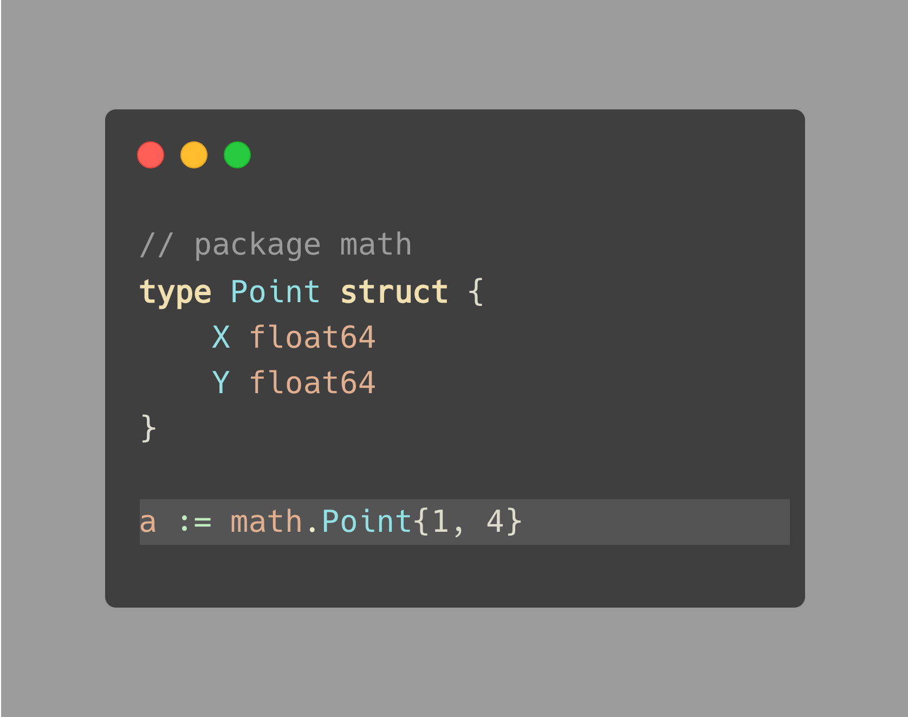
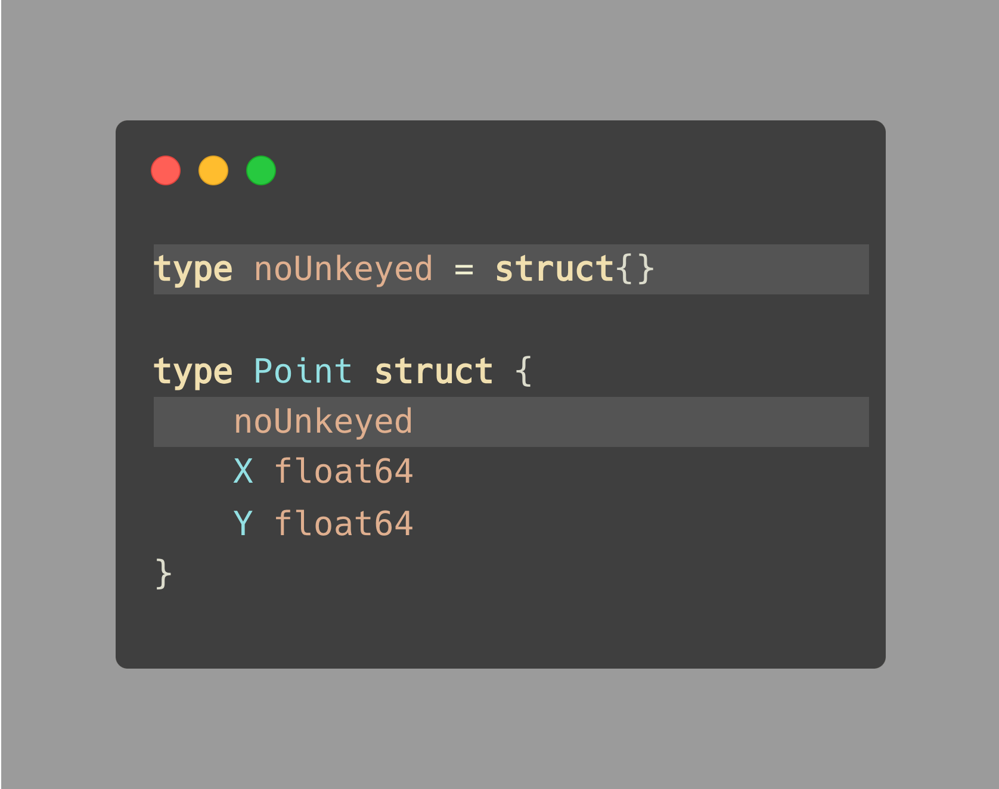

# Tip #55 使用空字段防止结构体无键字面量

> 原始链接：https://twitter.com/func25/status/1770792643892519079

这里的主要目的是确保当有人使用您的包并决定创建您的结构体的一个实例时，他们必须在其结构体字面量中使用**命名字段**。

假设我们有一个带有两个字段的结构体 Point：X 和 Y。

想象一下，您的库的用户像这样定义一个 Point（没有 X 和 Y）：

当然，这种方法对于常见的 Point 结构体来说并不是问题，因为它通常只包含 X 和 Y。

但是，如果您计划为它添加更多字段，比如一个字符串 `label` 字段呢？

在这种情况下，用户没有适应这种变化的代码将触发编译时错误：“struct literal of type config.Point 中值太少”，并且它不是向后兼容的。

这里有一个策略来鼓励客户端显式定义 X 和 Y：向结构体中添加一个特殊的变量，该变量：

- 非导出。
- 是大小为零的字段。

大小为零的类型的常见选择是空结构体（struct{}）和长度为零的数组。

这个解决方案类似于说，“这个 Point 不仅包括 X 和 Y，将来还会有更多。”

> “为什么是一个非导出的、零大小的字段？”

这是一个技巧，非导出的字段使得它在该包外部不可访问。零大小的字段不会增加结构体的内存大小。

如果您不喜欢 _ struct{} 语法，因为它在防止无键字面量方面的意图不够明确，可以考虑来自 [@nalesnikowydzem](https://twitter.com/nalesnikowydzem) 在提示 #50 中的建议（https://twitter.com/func25/status/1768621711929311620）：

> 译者注：他的建议是定义一个类型并嵌入到你的结构体中。 类似于标准库中的 noCopy{} 结构体。
>

依赖 linter 可能会捕获这个问题，但并非所有客户端都会使用 linter。

然而，在某些情况下，使用无键字面量可能是更受欢迎的，例如，在处理只包含 Key 和 Value 字段的映射元素时（例如 mongodb 中的 bson.E）。

如果确定这些不会改变，一致地指定 Key 和 Value 可能会降低代码的可读性。